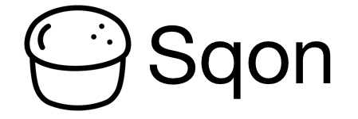

[](https://travis-ci.org/Sqon/sqon)
[](https://coveralls.io/github/Sqon/sqon?branch=master)
[](https://insight.sensiolabs.com/projects/c2a0df64-ebed-4f74-8300-e94ebf43dc40)


============================

- [Usage](#usage)
- [Requirements](#requirements)
- [Install](#install)
- [Documentation](#documentation)
    - [Event Subscribers](#event-subscribers)
- [Specification](#specification)
    - [Overview](#overview)
    - [Purpose](#purpose)
    - [Rationale](#rationale)
    - [Format](#format)
        - [Bootstrap](#bootstrap)
            - [Signature Verification](#signature-verification)
            - [Self Extraction](#self-extraction)
            - [Primary Script](#primary-script)
        - [Database](#database)
        - [Signature](#signature)
- [License](#license)
- [Logo](#logo)

Usage
-----

> The following uses a Symfony 3 project as an example. Sqon itself is project agnostic, so it will work on any PHP project regardless of how it is implemented.

```php
use Sqon\Iterator\DirectoryIterator;
use Sqon\Path\Memory;
use Sqon\Sqon;

// Start the process of creating a new Sqon.
Sqon::create('project.sqon')

    // Enable GZIP compression.
    ->setCompression(Sqon::GZIP)

    // Add all files in a Symfony 3 project directory.
    ->setPathsUsingIterator(new DirectoryIterator('test'))

    // Execute the console when the Sqon is executed.
    ->setPath(
        Sqon::PRIMARY,
        new Memory("<?php require __DIR__ . '/../bin/console';")
    )

    // Commit the changes to a file on disk.
    ->commit()

;
```

When you run `php project.sqon` you will see the Symfony 3 console.

Requirements
------------

- Current [PHP][] or [HHVM][] long term support release.
    - `pdo_sqlite`
    - `bz2` (if using bzip2 compression)
    - `zlib` (if using gzip compression)

[HHVM]: https://docs.hhvm.com/hhvm/installation/introduction#prebuilt-packages__lts-releases
[PHP]: https://secure.php.net/supported-versions.php

Install
-------

Add as a [Composer][] dependency:

    composer require sqon/sqon

[Composer]: https://getcomposer.org/

Documentation
-------------

As a developer creating or reading a Sqon, you will primarily be relying on the bundled implementation of [`SqonInterface`][], `Sqon`. You will need to read the interface documentation to have a high level understanding of how a Sqon is created, read, and modified.

Interacting with paths (files and directories) stored in a Sqon requires an understanding of the [`PathInterface`][] interface. When reading from a Sqon, you will be working with the `Memory` implementation of `PathInterface`. When adding individual paths to a Sqon, you will mostly be working with the [`File`][] implementation of `PathInterface`.

[`File`]: src/Sqon/Path/File.php
[`PathInterface`]: src/Sqon/Path/PathInterface.php
[`SqonInterface`]: src/Sqon/SqonInterface.php

### Event Subscribers

As documented in `SqonInterface`, the Sqon manager provides support for modifying certain processes using event listeners. The Sqon library provides a basic set of listeners that can be used to augment the Sqon building process.

#### `ChmodSubscriber`

The `ChmodSubscriber` will change the permissions of the committed Sqon.

```php
use Sqon\Event\Subscriber\ChmodSubscriber;

// Change permissions to 755 once committed.
$sqon->getEventDispatcher()->addSubscriber(
    new ChmodSubscriber(0755)
);
```

#### `FilterSubscriber`

The `FilterSubscriber` will filter paths that are set in the Sqon.

The subscriber is capable of filtering paths by their name (e.g. "script.php" in "/path/to/script.php") and by regular expression (e.g. "/tests/" will exclude "/path/test/example"). There are two important things to remember about how these rules can be used:

1. The "exclude" filters will always exclude anything that matches.
2. The "include" filters will only include things that match.

```php
use Sqon\Event\Subscriber\FilterSubscriber;

$sqon->getEventDispatcher()->addSubscriber(
    [
        'exclude' => [
            'name' => ['broken.php'],
            'regex' => ['/[Tt]est/']
        ],
        'include' => [
            'name' => ['LICENSE'],
            'regex' => ['/\.php$/']
        ]
    ]
);
```

> You can provide multiple names and regular expression to exclude or include by.

In the above example, the following paths will be allowed in the Sqon:

- `vendor/name/project/LICENSE`
- `src/My/Example/Class.php`

But the following paths will *not* be allowed in the Sqon:

- `assets/example.png`
- `src/broken.php`
- `tests/My/Example/ClassTest.php`

#### `ReplaceSubscriber`

The `ReplaceSubscriber` will search and replace patterns in some or all files.

```php
use Sqon\Event\Subscriber\ReplaceSubscriber;

$sqon->getEventDispatcher()->addSubscriber(
    new ReplaceSubscriber(
        [
            // Replace contents of specific files.
            'files' => [
                'path/to/script.php' => [
                    '/search/' => 'replace'
                ]
            ],

            // Replace contents of all files.
            'global' => [
                '/search/' => 'replace'
            ],

            // Replace contents of matching files.
            'regex' => [
                '/\.php$/' => [
                    '/search/' => 'replace'
                ]
            ]
        ]
    )
);
```

Specification
-------------

### Overview

A Sqon, pronounced "scone", is a PHP script with an embedded SQLite 3 database.

### Purpose

A Sqon is a self-extracting archive for packaging PHP applications and libraries for distribution. With the inclusion of an initialization script, a Sqon can be used as a command line application, autoloading library, or a web application (through PHP-FPM or another equivalent).

### Rationale

In 2012 I stumbled upon the [Phar][] file format. After having used it for multiple projects, I came to realize that the process for creating new Phars was needlessly complicated. To simplify the process, I created the [Box][] project which reduces many of the intricacies of creating Phars to a simple JSON configuration file. As the project picked up in popularity, there was a recurring theme in building Phars. The `phar` extension used to create Phars had not seen updates since 2009, which was evident in the types of bugs that were encountered while using Box. The community did many things to work around these issues, but ultimately the issues were there and biting those who did not expect or understand them.

I believe that the extension has stagnated because the maintainers are either too busy or have moved on, both reasons I can empathize with. I also believe that PHP developers capable of contributing patches in C are focused on other more pressing concerns with PHP.

I am hoping that by creating an alternative file format, it will be more accessible to developers for contributing bug fixes and even improvements. By using the battle tested SQLite database engine, I am hoping to avoid any issues relating to the storage and retrieval of data.

[Box]: https://github.com/box-project/box2
[Phar]: https://secure.php.net/phar

### Format

A Sqon is divided into three parts:

1. The PHP bootstrap script.
2. The embedded SQLite database.
3. The raw SHA-1 file signature.

#### Bootstrap

The PHP bootstrap script performs the following functions:

1. Verifies that the signature for the Sqon is valid.
2. Extracts the contents of the Sqon to a cache directory.
3. Runs the primary script, if one exists.

Variables, constants, functions, and classes are not introduced into the global scope by the script. If supporting code is required for the bootstrapping process, it must exist in the `Sqon\Bootstrap` namespace. Using the prefix `Sqon_Bootstrap_` for a function or class name is also acceptable.

If the Sqon is intended to be used as a command line application, a [shebang line][] should be prepended to the PHP bootstrap script. Otherwise, the shebang line should be omitted to prevent PHP from printing it.

[shebang line]: https://en.wikipedia.org/wiki/Shebang_(Unix)

##### Signature Verification

The PHP bootstrap script will generate a new hashing using the contents of the Sqon, excluding the last 20 bytes. The hash is then compared to the last 20 bytes of the Sqon. If the hashes are not identical, the script will exit with an error stating that the Sqon has been corrupted.

##### Self Extraction

The PHP bootstrap script generates a deterministic cache directory path that is specific to the Sqon. The path is composed of the following information:

1. The path to the system temporary directory.
2. The hexadecimal SHA-1 hash signature of the Sqon.

Alternatively, the directory path defined by the `SQON_TEMP` environment variable can be used in place of the system temporary directory.

If the cache directory exists, the self extraction process is not performed. If the directory does not exist, the following operations are performed:

1. The embedded database is extracted to a file called `sqon.db`.
2. The file cache directory, `files`, is created.
3. The files stored in the database are extracted to the file cache directory.

##### Primary Script

If the path `.sqon/primary.php` exists in the file cache directory, it will be loaded by the PHP bootstrap script in the global scope.

#### Database

> The `pdo_sqlite` extension is required.

The SQLite 3 database immediately follows the `__HALT_COMPILER();` call in the PHP bootstrap script. This allows the script to use the `__COMPILER_HALT_OFFSET__` constant to easily locate the beginning of the database for extraction. If a new Sqon is created, the following schema is used to create the SQLite database:

```sql
-- The directories and files stored in the database.
CREATE TABLE paths (

    -- The unique path.
    path VARCHAR(4096) NOT NULL,

    -- The type of the path (directory or file).
    type INTEGER NOT NULL,

    -- The compression mode.
    compression INTEGER NOT NULL,

    -- The last modified Unix timestamp.
    modified INTEGER NOT NULL,

    -- The Unix file permissions as decimal.
    permissions INTEGER NOT NULL,

    -- The contents of the file.
    contents BLOB,

    PRIMARY KEY (path)
);
```

> The following is information on what the schema definitions mean. For information on how this schema is actually used, you will want to read the [Bootstrap](#bootstrap) section of the specification.

- The **path** field is the canonicalized, relative path to the file or directory. All paths that begin with `.sqon` are reserved by the specification. The `/` (forward slash) is always used as the directory separator. All paths are case sensitive.
- The **type** field indicates the type of the path (e.g. file, directory).
- The **compression** field indicates if a file has been compressed and by what scheme.
- The **modified** field is a Unix timestamp for when the contents of the file were last modified.
- The **permissions** field is the numeric Unix permissions of the file encoded as decimal. If the permission for a file is `0644`, the value is stored as `420`.
- The **contents** field is the compressed or decompressed contents of the file.

**`type` Values**

| Value | Description                  |
|------:|:-----------------------------|
|   `0` | The path is for a file.      |
|   `1` | The path is for a directory. |

**`compression` Values**

| Value | Description                                   |
|------:|:----------------------------------------------|
|   `0` | The contents are not compressed.              |
|   `1` | The contents were compressed using **gzip**.  |
|   `2` | The contents were compressed using **bzip2**. |

##### Reservations

The SQLite database is reserved strictly for use by the Sqon specification. This is to prevent conflicts introduced through customizations of the database when an enhancement to the specification is defined or released.

#### Signature

The signature is a raw SHA-1 hash appended to the Sqon as the last 20 bytes of the file. This hash is generated by combining the PHP bootstrap script with the SQLite database.

> This signature is intended to be used as a way of verifying file integrity. If a cryptographically secure signature is required, GPG or another equivalent must be used. It is recommended that a detached signature be created for secure distributions.

License
-------

Sqon is released under both the [MIT][] and [Apache 2.0][] licenses.

[MIT]: misc/licenses/MIT.txt
[Apache 2.0]: misc/licenses/Apache%202.0.txt

Logo
----

The scone in the logo was created by [anbileru adaleru][] from the [Noun Project][].

[anbileru adaleru]: https://thenounproject.com/pronoun/
[Noun Project]: https://thenounproject.com/
